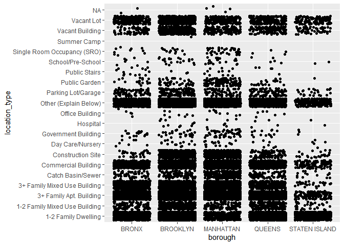
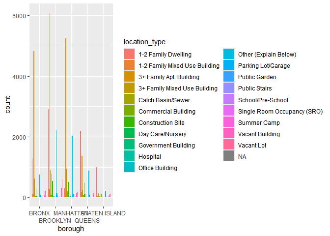
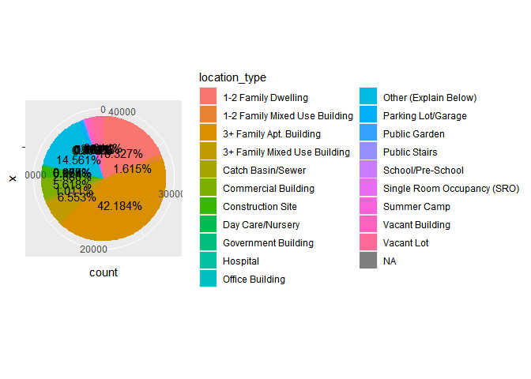
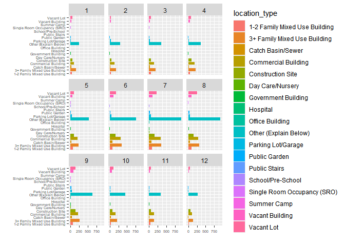
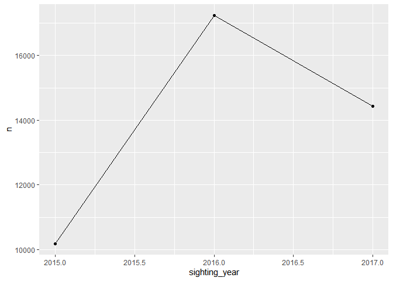

# Data Visualization Project 01

_revised version of mini-project 01 goes here_


``` r
library(tidyverse)
```

```
## ── Attaching core tidyverse packages ──────────────────────── tidyverse 2.0.0 ──
## ✔ dplyr     1.1.4     ✔ readr     2.1.5
## ✔ forcats   1.0.0     ✔ stringr   1.5.1
## ✔ ggplot2   3.5.1     ✔ tibble    3.2.1
## ✔ lubridate 1.9.3     ✔ tidyr     1.3.1
## ✔ purrr     1.0.2     
## ── Conflicts ────────────────────────────────────────── tidyverse_conflicts() ──
## ✖ dplyr::filter() masks stats::filter()
## ✖ dplyr::lag()    masks stats::lag()
## ℹ Use the conflicted package (<http://conflicted.r-lib.org/>) to force all conflicts to become errors
```

``` r
library(dplyr)
library(ggplot2)


# Load original data
rats <- read_csv("https://raw.githubusercontent.com/reisanar/datasets/master/rats_nyc.csv")
```

```
## Warning: One or more parsing issues, call `problems()` on your data frame for details,
## e.g.:
##   dat <- vroom(...)
##   problems(dat)
```

```
## Rows: 41845 Columns: 56
## ── Column specification ────────────────────────────────────────────────────────
## Delimiter: ","
## chr  (33): closed_date, agency, agency_name, complaint_type, descriptor, loc...
## dbl   (9): unique_key, incident_zip, x_coordinate_state_plane, y_coordinate_...
## lgl  (13): landmark, facility_type, school_or_citywide_complaint, vehicle_ty...
## dttm  (1): created_date
## 
## ℹ Use `spec()` to retrieve the full column specification for this data.
## ℹ Specify the column types or set `show_col_types = FALSE` to quiet this message.
```

``` r
borough_totals<- rats %>% 
  group_by(borough) %>% 
  summarize(total = n()) %>% 
  mutate(proportion = total / sum(total))
```


``` r
ggplot(rats, aes(x = borough, y = location_type)) +
  geom_jitter()
```

<!-- -->


``` r
ggplot(rats, aes(x = borough, fill = location_type)) +
  geom_bar(position = "dodge")+
scale_x_discrete(guide = guide_axis(n.dodge=2))
```

<!-- -->


``` r
ggplot(rats, aes(x="", fill=location_type)) +
  geom_bar(stat="count", width=1) +
  geom_text(aes(label = scales::percent(after_stat(count) / sum(after_stat(count)))), stat = "count", position = position_stack(vjust = .5)) +
  coord_polar("y", start = 0, direction = -1)
```

<!-- -->

``` r
rats_remove_outliers<- 
  rats%>%
  filter(location_type != "3+ Family Apt. Building")%>%
  filter(location_type != "1-2 Family Dwelling")
```


``` r
ggplot(rats_remove_outliers, aes(x= "")) + 
  geom_bar(aes(x = location_type, fill = location_type)) +
  coord_flip() +
  facet_wrap(~ sighting_month) + 
  labs(y = "", x = "") +
  theme(axis.text.x = element_text( size = 5),
        axis.text.y = element_text(size = 5))
```

<!-- -->

``` r
rats_by_year <- 
  rats %>%
  count(sighting_year) 

ggplot(data = rats_by_year, aes(x = sighting_year, y = n, group = 1)) +
  geom_line()+
  geom_point()
```

<!-- -->
