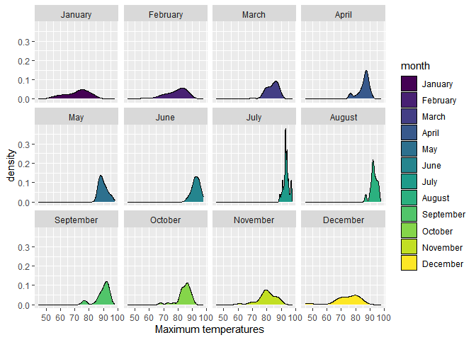

# Data Visualization Project 03


In this exercise you will explore methods to create different types of data visualizations (such as plotting text data, or exploring the distributions of continuous variables).


## PART 1: Density Plots

Using the dataset obtained from FSU's [Florida Climate Center](https://climatecenter.fsu.edu/climate-data-access-tools/downloadable-data), for a station at Tampa International Airport (TPA) for 2022, attempt to recreate the charts shown below which were generated using data from 2016. You can read the 2022 dataset using the code below: 


``` r
library(tidyverse)
weather_tpa <- read_csv("https://raw.githubusercontent.com/reisanar/datasets/master/tpa_weather_2022.csv")
# random sample 
sample_n(weather_tpa, 4)
```

```
## # A tibble: 4 × 7
##    year month   day precipitation max_temp min_temp ave_temp
##   <dbl> <dbl> <dbl>         <dbl>    <dbl>    <dbl>    <dbl>
## 1  2022     3     3          0          83       59     71  
## 2  2022     9    27          0.08       84       76     80  
## 3  2022    11    16          0.14       79       62     70.5
## 4  2022     6     6          0          91       77     84
```

See https://www.reisanar.com/slides/relationships-models#10 for a reminder on how to use this type of dataset with the `lubridate` package for dates and times (example included in the slides uses data from 2016).

Using the 2022 data: 

(a) Create a plot like the one below:


Hint: the option `binwidth = 3` was used with the `geom_histogram()` function.


``` r
library(lubridate)
library(dplyr)
library(ggplot2)


tpa_clean <- weather_tpa %>%
  unite("doy", year, month, day, sep = "-") %>%
  mutate(
    doy = ymd(doy), # Convert to Date format
    max_temp = as.double(max_temp), 
    min_temp = as.double(min_temp),
    precipitation = as.double(precipitation),
    month = month(doy, label = TRUE, abbr = FALSE) 
  )


ggplot(tpa_clean, aes(x = max_temp, fill = month)) +
  geom_histogram(binwidth = 3) +
  labs(
    x = "Maximum temperatures",
    y = "Number of Days"
  ) +
  facet_wrap(~ month)+ 
  scale_y_continuous()
```

<!-- -->


(b) Create a plot like the one below:


Hint: check the `kernel` parameter of the `geom_density()` function, and use `bw = 0.5`.


``` r
ggplot(data = weather_tpa,aes(x = max_temp,)) +
 geom_density(bw = .5, kernel = "epanechnikov", fill = "dark gray")+
  labs(x = "Maximum temperature")
```

<!-- -->


(c) Create a plot like the one below:


Hint: default options for `geom_density()` were used.


``` r
ggplot(tpa_clean, aes(x = max_temp, fill = month)) +
  geom_density() +
  labs(
    Title = "Density plots for each month in 2016",
    x = "Maximum temperatures"
  ) +
  facet_wrap(~ month)+ 
  scale_y_continuous()+
  scale_x_continuous()
```

<!-- -->


(d) Generate a plot like the chart below:


Hint: use the`{ggridges}` package, and the `geom_density_ridges()` function paying close attention to the `quantile_lines` and `quantiles` parameters. The plot above uses the `plasma` option (color scale) for the _viridis_ palette.


``` r
#install.packages("viridis")
library(viridis)
```

```
## Loading required package: viridisLite
```

``` r
library(ggridges)
tpa_month<- tpa_clean %>%
  mutate(month = month(doy))

ggplot(data = tpa_clean, aes(x = max_temp, y = factor(month), fill = max_temp)) +
  geom_density_ridges()+
   scale_fill_viridis_c(option = "C")
```

```
## Picking joint bandwidth of 1.93
```

```
## Warning: The following aesthetics were dropped during statistical transformation: fill.
## ℹ This can happen when ggplot fails to infer the correct grouping structure in
##   the data.
## ℹ Did you forget to specify a `group` aesthetic or to convert a numerical
##   variable into a factor?
```

<!-- -->

(e) Create a plot of your choice that uses the attribute for precipitation _(values of -99.9 for temperature or -99.99 for precipitation represent missing data)_.


``` r
tpa_clean_no_na <- tpa_clean %>%
  filter(max_temp != -99.9 & precipitation != -99.99)

ggplot(data = tpa_clean_no_na, aes(x = max_temp, y = precipitation)) +
  geom_point(alpha = 0.5, color = "blue") + 
  geom_smooth(method = "lm", color = "red") +  
 
  labs(
    x = "Max Temp",
    y = "Precipitation"
  ) +
  theme_minimal()
```

```
## `geom_smooth()` using formula = 'y ~ x'
```

<!-- -->


## PART 2 

> **You can choose to work on either Option (A) or Option (B)**. Remove from this template the option you decided not to work on. 


### Option (A): Visualizing Text Data

Review the set of slides (and additional resources linked in it) for visualizing text data: https://www.reisanar.com/slides/text-viz#1

Choose any dataset with text data, and create at least one visualization with it. For example, you can create a frequency count of most used bigrams, a sentiment analysis of the text data, a network visualization of terms commonly used together, and/or a visualization of a topic modeling approach to the problem of identifying words/documents associated to different topics in the text data you decide to use. 

Make sure to include a copy of the dataset in the `data/` folder, and reference your sources if different from the ones listed below:

- [Billboard Top 100 Lyrics](https://github.com/reisanar/datasets/blob/master/BB_top100_2015.csv)

- [RateMyProfessors comments](https://github.com/reisanar/datasets/blob/master/rmp_wit_comments.csv)

- [FL Poly News Articles](https://github.com/reisanar/datasets/blob/master/flpoly_news_SP23.csv)


(to get the "raw" data from any of the links listed above, simply click on the `raw` button of the GitHub page and copy the URL to be able to read it in your computer using the `read_csv()` function)

``` r
#setwd("C:/Users/hfort/OneDrive/Desktop/HF_dataviz_finproj/dataviz_final_project/data")
BB_top100_2015 = read.csv("C:/Users/hfort/OneDrive/Desktop/HF_dataviz_finproj/dataviz_final_project/data/BB_top100_2015.csv")
```

``` r
library(tidytext)
bb_bottom_10<-BB_top100_2015 %>% 
  filter(Rank %in% 91:100)%>%
    unnest_tokens(word, Lyrics)%>%
    filter(!word %in% stop_words$word, str_detect(word, "[a-z]"))
```


``` r
ggsave_proj_3<-bb_bottom_10 %>%
  inner_join(get_sentiments("bing")) %>%
  count(Song, sentiment) %>%
  spread(sentiment, n, fill = 0) %>%
  mutate(sentiment = positive - negative) %>% 
  ggplot() + 
  geom_bar(aes(x = reorder(Song, sentiment), 
               y = sentiment), 
           stat = "identity") + 
  coord_flip() + 
  labs(x = "", 
       title = "Sentiment Analysis of Songs using bing lexicon", 
       subtitle = " 90-100th best Billboard songs in 2015") + 
  theme_minimal()
```

```
## Joining with `by = join_by(word)`
```

``` r
ggsave_proj_3
```

<!-- -->

``` r
ggsave(ggsave_proj_3, file="bb_bottom_90_100png.png", scale=2)
```

```
## Saving 14 x 10 in image
```


